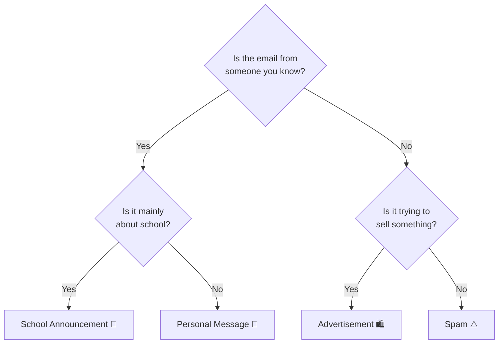

# Designing an Explainable AI System

**Related ILOs:** MM07
**Type:** In-class, Small groups, Unplugged · **Duration:** 60–90 minutes · **Scale:** large and small cohorts

> Expanded version: *(link to be added — placeholder in source)*

## Description

This activity aims to help students understand what explainability means in AI systems. Students work in groups of 3–4 to build and audit their own Explainable AI (XAI) models using a physical binary decision tree.

To begin, the instructor provides broad themes or familiar categories that the groups can choose from, such as animals, vehicles, cities, or email types. Each group selects one theme and chooses four distinct items that will appear at the bottom of the decision tree. The group acts as "AI Architects" and draws a branching tree made up of yes/no questions.

Each group creates a binary decision tree with two levels of yes/no questions, leading to four final items. Each decision point should have exactly two branches: yes and no. Each series of questions should lead to one specific item, as shown in the figure below. The group also creates one post-it note for each of the four items, for example "Personal Message," "School Announcement," "Advertisement," or "Spam."

*Example two-level decision tree for the "email types" theme* ([PNG from the source document](figures/xai-decision-tree-example.png)).

Once the decision trees are complete, the groups pair up for a two-part audit. The purpose of the audit is to explore how transparency can influence user trust.

**Round 1 — Black Box mode.** Both groups hide their decision trees. This represents a Black Box AI system because the complete decision structure is not visible to the users. However, the four post-it notes showing the possible items remain visible.

A student from Group B selects one of Group A's items without revealing their choice. Students in Group A then take turns asking yes/no questions until they identify the selected item. They do not show their complete decision tree or explain how their questions are organised. During this process, Group B may begin to infer parts of the hidden decision logic. The activity is then reversed, with a student from Group A selecting one of Group B's items.

**Round 2 — XAI mode.** Both groups reveal their decision trees to activate XAI Mode. The activity is repeated, but this time the students must follow the predefined decision tree. They physically trace their fingers along the branches and read the decision rules aloud. This allows them to show how each answer leads to the final result and provide a fully explained decision.

The session closes with a discussion of what explainability means in AI and how explanations can influence, increase, or reduce user trust. The discussion can be facilitated using the following prompting questions:

- What made the second system more explainable?
- Did seeing the decision path increase your trust? Why or why not?
- Could an explanation reveal that a system is flawed and reduce trust?
- Is a correct answer enough to justify trust?
- What makes an explanation useful rather than merely visible?

## Keywords

Explainable AI, Decision trees, Transparency, Black-box systems, User trust, Trust

## Prerequisites

- Definition of explainable AI systems
- Description of decision trees

## Resources

- 1 pack of post-it notes per team
- Flipcharts for drawing out each group's decision tree

## Assessment

No
