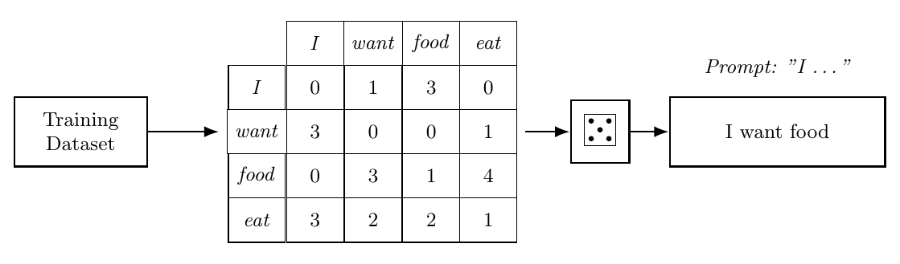

<!-- Ported by hand from the WG11 report, appendicies/activity1-lm-simulation.tex (Overleaf state bf239f6, 2026-09-14, report version 1 as submitted). The report appendix is the source of truth; re-port if it changes. -->

# LA03. Unplugged Language Model Simulation — expanded version

To help students internalize the fundamental mechanics underpinning modern large language models, this *unplugged* (i.e., on paper) simulation uses a bigram table describing the frequency of word pairs in a training text. Student groups are tasked with ‘generating’ text in emulation of a ‘next-word’ prediction model, which either selects the most likely next-word or samples possible next-words according to a frequency distribution. These bigram tables are constructed with a constrained vocabulary size and such that each column of frequencies sums to 6.[^1] This enables easy sampling, with randomness introduced by roll of a six-sided die. Given a die roll, students select the next word from the lefthand column, with the number on the die corresponding to the cumulative frequency going down the column of the previous word (i.e. the sum over previous words of freq(next-word | previous word)). Combined with different training text sources for each group, this stochasticity emphasizes the inherent variability in LLM outputs. After student groups generate and share unplugged language model outputs, the instructor may lead a class discussion connecting concepts and processes found in the simulation to key components of the transformer LLM architecture. In particular:

- The **training data** used to generate the frequency (n-gram) table is based on text from a single website, resulting in a very sparse table and limited diversity in next-word predictions. In large language models, the training data involved is orders of magnitude larger.
- The *n*-value of the *n*-gram model is analogous to an LLM's **context window**, which controls the amount of the prompt and previously generated words taken into account when generating the next word. The provided table illustrates a *bi*gram (*n* = 2), meaning that the distribution of next-words depends only on the immediate previous word. Students should connect the value of *n* and context window size to the semantic and substantive quality of generated outputs.
- Instead of n-grams, next-word probabilities for large language models are given by the attention mechanism, which provides a weighted sum of word vectors (embeddings). The resulting value combines relevant information obtained from different parts of the sentence, not just the (immediately) preceding words. Other text generation mechanics simulated in this activity (sampling method, stopping condition, training data) also apply when using the attention mechanism instead of n-grams.
- This activity involves two possible **sampling methods**. The first involves selecting only the most frequent next-word for the given previous word (i.e., top-*k* sampling with *k* = 1), which makes generations deterministic in the absence of ties in top frequencies. On the other hand, the dice rolls simulate (semi) random sampling according to the frequency distribution. More frequent word pairs appear more often, but the output is no longer deterministic. Students should consider how the sampling procedures affect the generated output.
- The implied **stopping condition** for text generation occurs when the previous word has no (non-zero) next-word entries in the frequency table. These columns are the result of truncating the size of the vocabulary shown in the table, and are more likely to occur with a flatter frequency distribution across many possible next-words.

An optional extension on this activity tasks students with replicating this simulation procedure in code following the same steps. A code simulation allows for a significant expansion of the frequency table, and increased sophistication in the sampling and stopping conditions, which should lead to more variable and more interesting text generations.

*Unplugged Language Model Generation Process*

[^1]: The full activity materials include a Python notebook with which the bigram tables can be generated. (Not yet in this repository; ask the activity author.)

## Activity instructions

Given a printed copy of a *bigram* frequency table (like the sample table below), in which each row shows the frequency with which the *next-word* occurs given a specific *previous word* (the columns on the right), generate a sentence of output with this language model using the following steps:

1. Start with a one-word ‘prompt’, such as “the”. This prompt constitutes the first *previous word*.
2. For the given *previous word* in the generated text, look at that word's column in the frequency table.
3. Roll a six-sided die to provide a random number. Sum the values in the *previous word*'s column according to the provided frequencies until you equal the random number. The row you stopped at indicates the selected *next-word* in the generation.
4. Add the *next-word* to your generated sentence, then update the *previous word* to be the *next-word*.
5. Repeat steps (2) through (4) until you arrive at a column with all 0s, at which point you have reached a stopping point and have completed the sentence.

Simulate the text generation process a few times. *Do you notice any common patterns in the generated text? How do your generations compare to other groups?*

### Sample bigram table generated from the Wikipedia article for “Dog”

| Next-word | the | of | dogs | and | in | to | a | dog | as | that |
|-----------|----:|---:|-----:|----:|---:|---:|--:|----:|---:|-----:|
| the  | 0 | 2 | 0 | 2 | 2 | 1 | 0 | 1 | 1 | 1 |
| of   | 0 | 0 | 0 | 0 | 0 | 0 | 0 | 1 | 0 | 1 |
| dogs | 3 | 1 | 0 | 0 | 1 | 2 | 0 | 0 | 1 | 1 |
| and  | 0 | 0 | 0 | 0 | 0 | 0 | 0 | 1 | 0 | 0 |
| in   | 0 | 0 | 0 | 0 | 0 | 0 | 0 | 0 | 0 | 0 |
| to   | 0 | 0 | 0 | 2 | 1 | 0 | 0 | 1 | 1 | 0 |
| a    | 0 | 2 | 0 | 2 | 1 | 1 | 0 | 1 | 2 | 1 |
| dog  | 3 | 1 | 0 | 0 | 1 | 0 | 6 | 0 | 1 | 1 |
| as   | 0 | 0 | 0 | 0 | 0 | 1 | 0 | 1 | 0 | 1 |
| that | 0 | 0 | 0 | 0 | 0 | 1 | 0 | 0 | 0 | 0 |

Columns are the *previous word*; rows are the *next-word*. Each column sums to 6, so one die roll selects a row.
