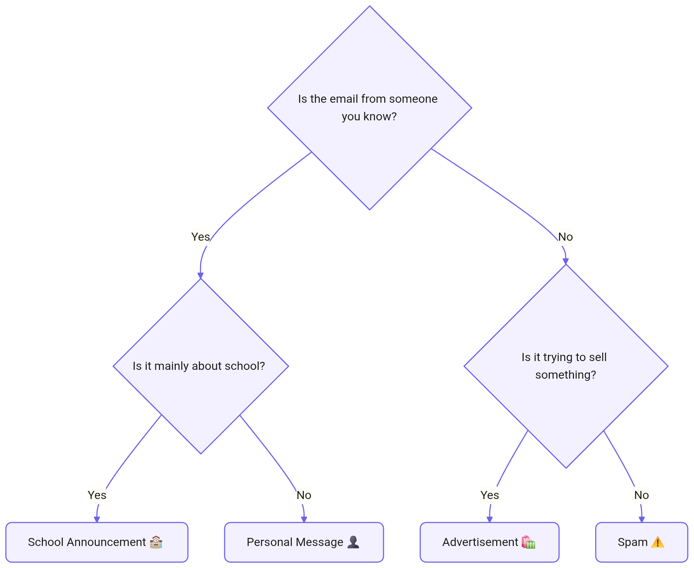

<!-- Ported by hand from the WG11 report, appendicies/activity4-explainable-ai.tex (Overleaf state fb8ec81, 2026-09-12). The report appendix is the source of truth; re-port if it changes. -->

# LA08. Designing an Explainable AI System — expanded version

## Purpose

This learning activity helps students understand what explainability means in AI systems and how explanations can influence user trust. The activity takes place in three stages: students first build a simple binary decision tree, then test it in a Black Box round with the tree hidden, and finally repeat the task in an Explainable AI (XAI) round with the tree visible and explained.

By the end of the activity, students should be able to explain what XAI means and describe how explanations can influence user trust.

## What educators need

For each group of 3–4 students, provide:

- One large sheet of paper or whiteboard space
- Markers
- Four post-it notes or cards
- One suggested theme or set of four items (leaf nodes)
- Optional: observation sheet or trust-rating scale

Groups should ideally be paired for the two rounds of audits (Black Box and XAI rounds). With an odd number of groups, three groups can rotate or the instructor can join one group.

## Timing

The activity can be completed in approximately 60–90 minutes:

- Introduction and instructions: 5–10 minutes
- Building the decision tree: ~20 minutes
- Black Box round: 10–15 minutes
- XAI round: 10–15 minutes
- Discussion and reflection: ~15 minutes

## Preparation

The instructor provides broad themes or familiar categories (such as car brands, food, etc.) that students can choose from. Each theme should contain four possible items. More items can be used to increase the complexity of the decision tree and the activity.

The four items should be similar enough to require thoughtful questions. If the items are too different, the classification may be too easy.

Each group creates a binary decision tree with:

- Two levels of yes/no questions
- Exactly two branches at each decision point: yes and no
- Four final outputs, called leaf nodes
- One post-it note for each output

Before the audit, groups should test all four paths and confirm that each path leads to one unique output. The instructor should remind students that different groups may design different decision trees for the same four items.

## Activity procedure

1. Students choose four outputs and write them on separate post-it notes.
2. They build and test a binary decision tree that leads to the four outputs.
3. Each group pairs with another group.
4. The groups complete the Black Box round with their decision trees hidden.
5. They repeat the activity in the XAI round with their decision trees visible.
6. Students compare the two experiences and discuss explainability and trust.

## Facilitating the audit

### Black Box round

Groups hide their complete decision trees but keep the four output cards visible.

One student from Group B secretly selects one of Group A's output cards. Group A uses the questions from its decision tree to identify the selected output. However, Group A does not show the tree or explain how the questions are connected.

The activity is then reversed, with Group A selecting one of Group B's outputs.

### XAI round

Groups reveal their decision trees and repeat the activity. This time, students follow the predefined path, trace each branch, and explain aloud how each answer leads to the final output. The comparison should focus on whether seeing the complete decision process changes how understandable or trustworthy the system appears.

## Supporting students during the activity

While groups build and test their trees, educators can ask:

- Does every path lead to one output?
- Could an item fit into more than one category?
- Are any questions vague or subjective?
- Would another person interpret the rules differently?
- Does the explanation make any weaknesses easier to notice?

Students do not need to create a perfect model. Ambiguous cases and flawed rules can support the discussion about why explainability matters.

## Scaling the activity

For a large class, several groups can work with the same four outputs. This makes it possible to compare different decision trees created for the same classification task. A gallery walk can replace paired audits. Groups display their trees, and students rotate around the room to identify unclear rules, possible errors, and differences between models.

For a **shorter session**, the instructor can provide the four outputs and the first decision question. For a **more advanced** version, groups can work with more outputs and therefore build a larger decision tree. For example, eight outputs would require an additional level of yes/no questions. The instructor can also provide ambiguous test cases and ask students to revise their trees after discovering classification problems.

## Closing discussion

The session closes with a discussion of what explainability means and how explanations can influence, increase, or reduce user trust.

Useful questions include:

- What made the second system more explainable?
- Did seeing the decision path change your trust?
- Did the explanation reveal any weak or unclear rules?
- Is a correct output enough to justify trust?
- What makes an explanation useful to a user?

The main conclusion should be that explainability does not automatically make an AI system trustworthy. It gives users more information with which to judge whether trust is justified.

## Example 1: Email classification

**Possible outputs (i.e., leaf nodes)**

- Personal Message
- School Announcement
- Advertisement
- Spam

**Possible decision questions**

1. Is the email from someone you know?
2. If yes: Is it mainly about school?
3. If no: Is it trying to sell something?

**Why this example works:** the categories may overlap. For example, a school email might also promote an event. This creates opportunities to discuss unclear rules, mistakes, and how explanations can reveal weaknesses in a model.

*Example decision tree for email classification.*

## Example 2: Digital tools

**Possible outputs (i.e., leaf nodes)**

- Calculator
- Search Engine
- Chatbot
- Translation App

**Possible decision questions**

1. Does the tool mainly work with language?
2. If yes: Does it translate between languages?
3. If no: Does it mainly perform calculations?

**Why this example works:** the tools have different purposes, but some functions may overlap. Students must decide which features are most important for classification.
